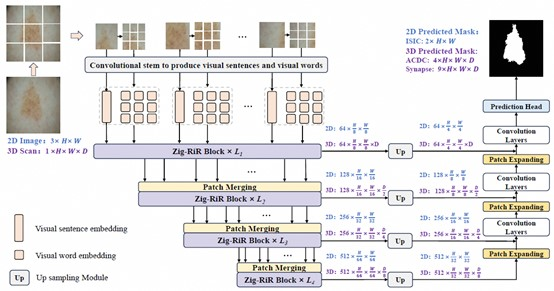
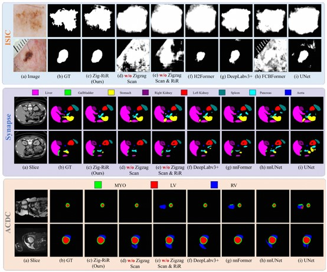

# [TMI 2025] Zig-RiR: Zigzag RWKV-in-RWKV for Efficient Medical Image Segmentation

[Tianxiang Chen](https://scholar.google.com/citations?user=vTy9Te8AAAAJ&hl=en&authuser=1&oi=sra)<sup>1,2</sup>, Xudong Zhou<sup>1</sup>, [Zhentao Tan](https://scholar.google.com/citations?user=VCX7itEAAAAJ&hl=en)<sup>1,2</sup>, [Yue Wu](https://scholar.google.com/citations?user=srajsjoAAAAJ&hl=en)<sup>2</sup>, [Ziyang Wang](https://scholar.google.com/citations?user=GWF20_wAAAAJ&hl=en)<sup>3,4</sup>, [Zi Ye](https://scholar.google.com/citations?user=1V0CqfYAAAAJ&hl=en)<sup>5</sup>, [Tao Gong](https://scholar.google.com/citations?user=_JhW9D0AAAAJ&hl=en)<sup>1</sup>,  [Qi Chu](https://scholar.google.com/citations?user=JZjOMdsAAAAJ&hl=en)<sup>1</sup>,  [Nenghai Yu](https://scholar.google.com/citations?user=7620QAMAAAAJ&hl=en)<sup>1</sup>, and [Lu Le](https://scholar.google.com/citations?user=kZn0f6gAAAAJ&hl=en)<sup>6</sup>

University of Science and Technology of China<sup>1</sup>, Alibaba Cloud<sup>2</sup>, University of Oxford<sup>3</sup>, The Alan Turing Institute<sup>4</sup>, Trinity College Dublin<sup>5</sup>, Alibaba DAMO Academy<sup>6</sup>

[](https://ieeexplore.ieee.org/document/10526382)


## :rocket: News
* **(April 10, 2025):** We're thrilled to share that Zig-RiR has been accepted to IEEE TMI-2025! 🎊.

<hr />


> **Abstract:** *Medical image segmentation has made signiffcant
 strides with the development of basic models.
Speciffcally, models that combine CNNs with transformers
can successfully extract both local and global features.
However, these models inherit the transformer’s quadratic
computational complexity, limiting their efffciency. Inspired
by the recent Receptance Weighted Key Value (RWKV)
model, which achieves linear complexity for long-distance
modeling, we explore its potential for medical image segmentation.
 While directly applying vision-RWKV yields suboptimal
 results due to insufffcient local feature exploration
and disrupted spatial continuity, we propose a novel nested
structure, Zigzag RWKV-in-RWKV (Zig-RiR), to address
these issues. It consists of Outer and Inner RWKV blocks to
adeptly capture both global and local features without disrupting
 spatial continuity. We treat local patches as ”visual
sentences” and use the Outer Zig-RWKV to explore global
information. Then, we decompose each sentence into subpatches
 (”visual words”) and use the Inner Zig-RWKV to
further explore local information among words, at negligible
 computational cost. We also introduce a Zigzag-WKV
attention mechanism to ensure spatial continuity during
token scanning. By aggregating visual word and sentence
features, our Zig-RiR can effectively explore both global
and local information while preserving spatial continuity.
Experiments on four medical image segmentation datasets
of both 2D and 3D modalities demonstrate the superior
accuracy and efffciency of our method, outperforming the
state-of-the-art method 14.4 times in speed and reducing
GPU memory usage by 89.5% when testing on 1024 × 1024
high-resolution medical images.* 
<hr />


## Architecture overview of Zig-RiR
Overview of our Zig-RiR with hierarchical encoder-decoder structure. Zig-RiR adopts a U-shaped
architecture consisting of a convolutional stem, a Zig-RiR
encoder, and a plain decoder. The key innovation lies in
the Zig-RiR block, which features a nested RWKV-in-RWKV
structure and a novel Zigzag WKV attention mechanism.



<hr />


## visualizaion Results

### on ISIC & Synapse & ACDC Dataset

Qualitative comparison on skin leison segmentation (ISIC) and multi-organ segmentation (Synapse & ACDC) tasks. Our proposed Zig-RiR achieves accurate segmentation performance against existing methods.



<hr />

## Installation
The code is tested with PyTorch 1.11.0 and CUDA 11.3. After cloning the repository, follow the below steps for installation,

1. Create and activate conda environment
```shell
conda create --name unetr_pp python=3.8
conda activate unetr_pp
```
2. Install PyTorch and torchvision
```shell
pip install torch==1.11.0+cu113 torchvision==0.12.0+cu113 --extra-index-url https://download.pytorch.org/whl/cu113
```
3. Install other dependencies
```shell
pip install -r requirements.txt
```
<hr />


## Dataset
We follow the same dataset preprocessing as in [nnFormer](https://github.com/282857341/nnFormer). We conducted extensive experiments on five benchmarks: Synapse, BTCV, ACDC, BRaTs, and Decathlon-Lung. 

The dataset folders for Synapse should be organized as follows: 

```
./DATASET_Synapse/
  ├── unetr_pp_raw/
      ├── unetr_pp_raw_data/
           ├── Task02_Synapse/
              ├── imagesTr/
              ├── imagesTs/
              ├── labelsTr/
              ├── labelsTs/
              ├── dataset.json
           ├── Task002_Synapse
       ├── unetr_pp_cropped_data/
           ├── Task002_Synapse
 ```
 
 The dataset folders for ACDC should be organized as follows: 

```
./DATASET_Acdc/
  ├── unetr_pp_raw/
      ├── unetr_pp_raw_data/
           ├── Task01_ACDC/
              ├── imagesTr/
              ├── imagesTs/
              ├── labelsTr/
              ├── labelsTs/
              ├── dataset.json
           ├── Task001_ACDC
       ├── unetr_pp_cropped_data/
           ├── Task001_ACDC
 ```
 
  The dataset folders for Decathlon-Lung should be organized as follows: 

```
./DATASET_Lungs/
  ├── unetr_pp_raw/
      ├── unetr_pp_raw_data/
           ├── Task06_Lung/
              ├── imagesTr/
              ├── imagesTs/
              ├── labelsTr/
              ├── labelsTs/
              ├── dataset.json
           ├── Task006_Lung
       ├── unetr_pp_cropped_data/
           ├── Task006_Lung
 ```
   The dataset folders for BRaTs should be organized as follows: 

```
./DATASET_Tumor/
  ├── unetr_pp_raw/
      ├── unetr_pp_raw_data/
           ├── Task03_tumor/
              ├── imagesTr/
              ├── imagesTs/
              ├── labelsTr/
              ├── labelsTs/
              ├── dataset.json
           ├── Task003_tumor
       ├── unetr_pp_cropped_data/
           ├── Task003_tumor
 ```
 
Please refer to [Setting up the datasets](https://github.com/282857341/nnFormer) on nnFormer repository for more details.
Alternatively, you can download the preprocessed dataset for [Synapse](https://mbzuaiac-my.sharepoint.com/:u:/g/personal/abdelrahman_youssief_mbzuai_ac_ae/EbHDhSjkQW5Ak9SMPnGCyb8BOID98wdg3uUvQ0eNvTZ8RA?e=YVhfdg), [ACDC](https://mbzuaiac-my.sharepoint.com/:u:/g/personal/abdelrahman_youssief_mbzuai_ac_ae/EY9qieTkT3JFrhCJQiwZXdsB1hJ4ebVAtNdBNOs2HAo3CQ?e=VwfFHC), [Decathlon-Lung](https://mbzuaiac-my.sharepoint.com/:u:/g/personal/abdelrahman_youssief_mbzuai_ac_ae/EWhU1T7c-mNKgkS2PQjFwP0B810LCiX3D2CvCES2pHDVSg?e=OqcIW3), [BRaTs](https://mbzuaiac-my.sharepoint.com/:u:/g/personal/abdelrahman_youssief_mbzuai_ac_ae/EaQOxpD2yE5Btl-UEBAbQa0BYFBCL4J2Ph-VF_sqZlBPSQ?e=DFY41h), and extract it under the project directory.

## Training
The following scripts can be used for training our UNETR++ model on the datasets:
```shell
bash training_scripts/run_training_synapse.sh
bash training_scripts/run_training_acdc.sh
bash training_scripts/run_training_lung.sh
bash training_scripts/run_training_tumor.sh
```

<hr />

## Evaluation

To reproduce the results of UNETR++: 

1- Download [Synapse weights](https://drive.google.com/file/d/13JuLMeDQRR_a3c3tr2V2oav6I29fJoBa) and paste ```model_final_checkpoint.model``` in the following path:
```shell
unetr_pp/evaluation/unetr_pp_synapse_checkpoint/unetr_pp/3d_fullres/Task002_Synapse/unetr_pp_trainer_synapse__unetr_pp_Plansv2.1/fold_0/
```
Then, run 
```shell
bash evaluation_scripts/run_evaluation_synapse.sh
```
2- Download [ACDC weights](https://drive.google.com/file/d/15YXiHai1zLc1ycmXaiSHetYbLGum3tV5) and paste ```model_final_checkpoint.model``` it in the following path:
```shell
unetr_pp/evaluation/unetr_pp_acdc_checkpoint/unetr_pp/3d_fullres/Task001_ACDC/unetr_pp_trainer_acdc__unetr_pp_Plansv2.1/fold_0/
```
Then, run 
```shell
bash evaluation_scripts/run_evaluation_acdc.sh
```


3- Download [Decathlon-Lung weights](https://mbzuaiac-my.sharepoint.com/:u:/g/personal/abdelrahman_youssief_mbzuai_ac_ae/ETAlc8WTjV1BhZx7zwFpA8UBS4og6upb1qX2UKkypMoTjw?e=KfzAiG) and paste ```model_final_checkpoint.model``` it in the following path:
```shell
unetr_pp/evaluation/unetr_pp_lung_checkpoint/unetr_pp/3d_fullres/Task006_Lung/unetr_pp_trainer_lung__unetr_pp_Plansv2.1/fold_0/
```
Then, run 
```shell
bash evaluation_scripts/run_evaluation_lung.sh
```

4- Download [BRaTs weights](https://drive.google.com/file/d/1LiqnVKKv3DrDKvo6J0oClhIFirhaz5PG) and paste ```model_final_checkpoint.model``` it in the following path:
```shell
unetr_pp/evaluation/unetr_pp_lung_checkpoint/unetr_pp/3d_fullres/Task003_tumor/unetr_pp_trainer_tumor__unetr_pp_Plansv2.1/fold_0/
```
Then, run 
```shell
bash evaluation_scripts/run_evaluation_tumor.sh
```

<hr />

## Acknowledgement
This repository is built based on [nnFormer](https://github.com/282857341/nnFormer) repository.

## Citation
If you use our work, please consider citing:
```bibtex
@ARTICLE{10526382,
  title={UNETR++: Delving into Efficient and Accurate 3D Medical Image Segmentation}, 
  author={Shaker, Abdelrahman M. and Maaz, Muhammad and Rasheed, Hanoona and Khan, Salman and Yang, Ming-Hsuan and Khan, Fahad Shahbaz},
  journal={IEEE Transactions on Medical Imaging}, 
  year={2024},
  doi={10.1109/TMI.2024.3398728}}

```

## Contact
Should you have any question, please create an issue on this repository or contact me at abdelrahman.youssief@mbzuai.ac.ae.
